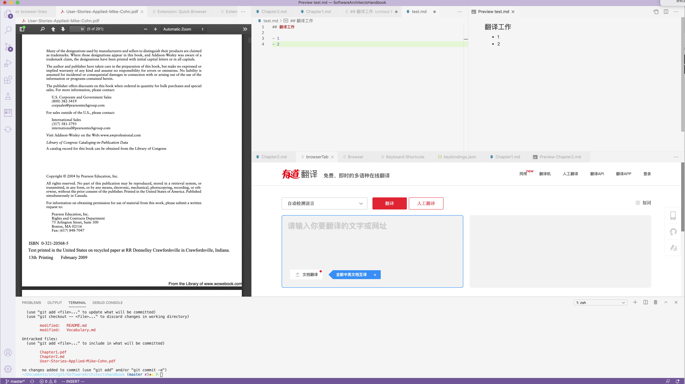
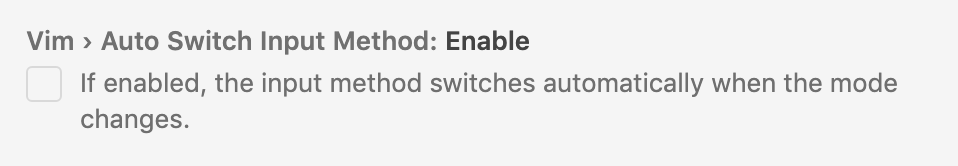

### 需求

最近接了一个软件架构英文书的翻译工作。我作为一个电脑上会同时开N多的个窗口的人来说，做翻译工作时一直要在无数个窗口里找到我要用的几个应用，很痛苦。

于是我想构造一个翻译工作的集成环境。

需要集成的内容有：

- MarkDown渲染——因为译文想用Markdown排版
- Pdf reader——英文原搞是pdf格式的。
- 有道翻译——翻译用
- MarkDown转pdf——最后成品需要转成pdf给出版社
- git——译文稿件需要一个版本管理，还能用github做备份和review。
- vim——工作用vim习惯了，不过vim下用中文输入法在模式切换时有很多问题

### 踩坑
可以用vscode加一堆插件来做这个集成环境。

开始找插件，MarkDown用的Markdown All in One， MarkDown转pdf用的 Markdown pdf，vim用的“vim”，git用的GitHistory，这几个都比较顺利，插件也比较成熟，甚至能好多种里选一个。


翻译和pdf reader的插件头大了。

翻译我想用一个web浏览器tab来打开fanyi.youdao，本来以为特别简单常见的一个需求，结果插件各种不好用，要么对js支持不好（也可能是对ajax支持不好），要么不支持粘贴。

pdf的插件vscode-pdf，看似展现特别好，结果从pdf里复制的话，所有换行都消失。


本来理想状态是这么个样子：



然而并没有成功。

### 折中
折腾了很久放弃了这种集成翻译的想法，直接去找翻译相关的插件。结果发现翻译插件做的都不太好。最后找到一款叫transNnote的有道翻译插件，它是直接翻译被选中文字。但其实做的很不太好，字数多了就翻译不了，偶尔简单词组也翻译不出。不过好歹能用。

为了进一步集成，我做了一个User Task

```
task.json:
{
    // See https://go.microsoft.com/fwlink/?LinkId=733558
    // for the documentation about the tasks.json format
    "version": "2.0.0",
    "tasks": [
        {
            "label": "selectLine",
            "command": "${command:expandLineSelection}"
        },
        {
            "label": "translate",
            "command": "${command:extension.transNnote}"
        },
        {
            "label": "unselect",
            "command": "${command:cancelSelection}"
        },
        {
            "label": "translateCurrentLine",
            "dependsOrder": "sequence",
            "dependsOn": [
                "selectLine",
                "translate",
                "unselect",
            ],
            "problemMatcher": []
        }
    ]
}

```

这个task是组合了“选中本行”“翻译选中内容”“反选中”三个操作，再映射一个快捷键：

```
keybindings.json:

    {
        "key": "cmd+y",
        "command": "workbench.action.tasks.runTask",
        "args":"translateCurrentLine"
    }

```

可以做到一键机翻当期行，然后再审查和修改。

## Vim

vim写代码很爽，跟中文结合就很蛋疼。每次写完中文切到normal mode就用不了，只能手切回来进insert mode再手切回去。

我自己的vim是用[xkbswitch](https://github.com/lyokha/vim-xkbswitch)插件搞定的。

发现vscode的Vim插件本身就带一个自动切换配置：



需要去下一个[im-select](https://github.com/daipeihust/im-select)的程序，这个程序的作者叫daipeihust，名字里有hust的，我去查了一下还真是我校友，开森。

配置好自动切换后丝般顺滑。
